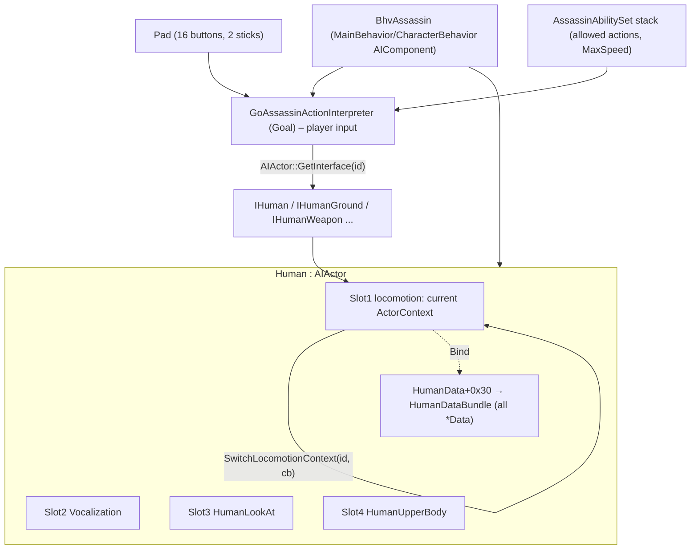

# 01 — Human core, state-module ("ActorContext") framework, player input → movement

Status: first pass, static analysis only (IDA session `ac1`, exe v1.02 b86610).
Everything cites the function it came from. **(hypothesis)** marks guesses.

---

## 1. Summary (plain words)

* `Human` (vftable 0x16d9314) derives from `AIActor` (vftable 0x168bb3c) and implements `IHuman`
  (second vftable at Human+0xFC, 0x16d91b4). RTTI: `Human : AIActor : Object`, `IHuman` at +0xFC (252).
* The movement "state modules" are **ActorContexts** (`scimitar::ActorContext`, vftable 0x173e23c,
  16 slots). Each module class is
  `HumanX : DataContext<Human,HumanData,HumanXData> : ActorContext` (+ a non-polymorphic base
  `FSMStaticState` embedded at +4, used for the module's internal sub-state machine), plus interface
  sub-objects at +0x14/+0x18/+0x1C/... (`IHumanClimb`, `IHumanDamage`, `IHumanTeleport`, ...).
* Contexts are identified by the reflected enum **ActorContextID** (0 NO_TRANSITION, 1 INITIALIZATION,
  2 NOT_DEFINED, 3 Debug, 4 Ground, 5 Ladder, 6 Pole, 7 Rope, 8 InAir, 9 Ledge, 10 Climb, 11 Walling,
  12 NarrowObject, 13 Riding, 14 PushableContext, 15 RagdollGround, 16 Vocalization, 17 CustomAction,
  18 LookAt, 19 Kiosk, 20 Dead, 21 HayStack, 22 UpperBody).
* `AIActor` owns **5 "extension slots"** (enum `AIActor::ExtensionSlot`), each a tiny FSM holding
  one *current* context. For Human:
  * slot 0 – unused / debug,
  * **slot 1 – locomotion** (Ground, InAir, Ledge, Climb, Ladder, Pole, Rope, Walling, NarrowObject,
    Riding, Kiosk, HayStack, Dead, RagdollGround, Debug) — exactly one active at a time,
  * slot 2 – Vocalization, slot 3 – HumanLookAt, slot 4 – HumanUpperBody (always-on layers).
* A transition is **immediate**: `AIActor::SwitchLocomotionContext(newID, callback)` (0x55F7E0)
  = `old->Exit(); prevID = old.id; callback(); current = GetOrCreate(newID); justSwitched = 1; new->Enter()`.
  The callback is a member-function delegate that usually builds a `TransitionSetupDataToX` object
  on the stack and calls its `Apply(destData)` (slot 0) to write entry parameters into the
  destination module's `*Data` block. There is no queued request — modules call the switch from
  inside their own Update.
* The per-module `*Data` objects are **runtime state** (sub-state, entry type, ...), not tuning;
  they all live in one `HumanDataBundle` (0x1180 bytes) pointed to by `HumanData+0x30`.
* Per frame: `AIActor::Update` (vt slot 15) calls `ctx->Update(0)` for each slot's current context;
  `AIActor::PostUpdate` (vt slot 18) calls `Update(1)` on the locomotion context only. A context that
  was switched-in this frame skips its first update (the `justSwitched` byte).
* Player input is NOT in `StPadControlled` (that is an empty marker "State" of the behaviour
  system, StateID_PadControlled=0). The real pad → action logic is the goal
  **`GoAssassinActionInterpreter`** (vftable 0x16f52ac, code 0xED4000–0xEF0000). It reads the
  `Pad` (16 virtual buttons + 2 sticks), applies a 0.35 stick dead-zone, high-profile (RT/right mouse)
  and "legs" (A) buttons, consults the `AssassinAbilitySet` stack (allowed actions + MaxSpeed), and
  drives the Human through interface pointers obtained with `AIActor::GetInterface(id)` (0x55FBC0):
  `IHumanGround::SetMoveDir`, `SetMoveSpeed`, jump/climb/walling requests, etc.

---

## 2. Object layouts

### 2.1 AIActor (base of Human) — 0x55F570 (reset), 0x55F9B0, 0x55F7E0, 0x55FEA0, 0x55F4E0
```
AIActor+0x00  vftable
AIActor+0x04 + 0x30*s   ExtensionSlot s (s = 0..4), 48 bytes:
   +0x00 u8   justSwitched          (set by switch, consumed by Update → skip first update)
   +0x04 ptr  contexts[]            (array of ActorContext* registered in this slot)
   +0x08 u32  count | cap<<14 | flags (scimitar array bitfield, count = &0x3FFF)
   +0x0C i32  startContextID        (set by RegisterStartContext 0x55F4E0; created on Start)
   +0x10 i32  previousContextID     (reset = 1 INITIALIZATION)
   +0x14 ptr  currentContext        (ActorContext*)
   +0x18 16B  onStart delegate {pmf, thisAdj, object, invoker}  (invoker(&deleg, object))
   +0x28 ptr  owner (the AIActor, used as factory: owner->vt[9](slot,id))
   +0x2C i32  slot index
  => slot 1 (locomotion): justSwitched +0x34, prevID +0x44, current +0x48, owner +0x5C, idx +0x60
AIActor+0xF8 u8   "contexts started" flag (GetInterface returns IHuman only until set) (0x55FBC0)
```
### 2.2 Human (selected) — ctor 0xB2BDE0, init 0xB2C340, reset 0xB285B0
```
+0x000 vftable Human (25 slots, 0x16d9314)
+0x0FC IHuman vftable (87 slots, 0x16d91b4)   <- interface id 0
+0x100 HumanData (embedded, 0x378 B, ctor 0xB30330)
        HumanData+0x30 -> HumanDataBundle (0x1180 B, ctor 0xC837F0)
+0x480 (1152) lazily-created context singletons, created by Human__GetOrCreateContext 0xB173A0:
        +0x480 Ground  +0x484 Ladder +0x488 Pole  +0x48C Rope  +0x490 InAir
        +0x494 Ledge   +0x498 Climb  +0x49C Walling +0x4A0 Riding +0x4A4 Kiosk
        +0x4A8 Dead    +0x4AC HayStack +0x4B0 Debug +0x4B4 Vocalization +0x4B8 LookAt
        +0x4BC NarrowObject  +0x4C0 UpperBody  +0x4C4 RagdollGround
+0x524 (1316) self pointer (set in reset 0xB285B0)
+0x808 (2056) 5 or 21 depending on entity flag (hypothesis: collision layer)
+0xA90.. ints reset to 1 in 0xB285B0
+0xB61..0xB6A bytes: per-frame flags (cleared in PostUpdate 0xB26FD0)
```
### 2.3 HumanDataBundle (0xC837F0) — getters 0xB2FC40..0xB2FD80 (`mov eax,[ecx+30h]; add eax,imm`)
| off | class | getter |
|---|---|---|
|+0x10|DebugContextData|0xB2FC40|
|+0x40|HumanGroundData|0xB2FC50|
|+0x340|HumanInAirData|0xB2FC60|
|+0x740|HumanLadderData|0xB2FC70|
|+0xA10|HumanPoleData|0xB2FC80|
|+0xC10|HumanRopeData|0xB2FC90|
|+0xC50|HumanLedgeData|0xB2FCA0|
|+0xDA0|HumanClimbData|0xB2FCB0|
|+0xE10|HumanWallingData|0xB2FCC0|
|+0xE40|HumanNarrowObjectData|0xB2FCD0|
|+0x1000|HumanRidingData|0xB2FCE0|
|+0x1040|HumanPushableContextData|0xB2FCF0|
|+0x1070|HumanCustomActionData|0xB2FD00|
|+0x1080|HeadOrientationData|0xB2FD10|
|+0x10B0|VocalizationData|0xB2FD20|
|+0x10CC|HumanLookAtData|0xB2FD30|
|+0x10E0|HumanKioskData|0xB2FD40|
|+0x1110|HumanDeadData|0xB2FD50|
|+0x1120|HumanHayStackData|0xB2FD60|
|+0x1150|HumanUpperBodyData|0xB2FD70|
|+0x1158|RagdollGroundData|0xB2FD80|

All `*Data` derive from `ActorContextData` (ctor 0x718070); `ActorContextData+4` = the ContextID
(written by each module's Bind slot, e.g. HumanClimb 0xDE4F50 writes 10).

### 2.4 Common ActorContext / module header (HumanClimb ctor 0xDF9E40, ActorContext ctor 0x116C0B0)
```
+0x00 vftable (16 base slots, more in HumanGround: 19)
+0x04 FSMStaticState (non-polymorphic, 0x10 B) – module sub-state machine base
+0x08 owner Human*  (set by AIActor::RegisterContext 0x560290)
+0x0C HumanData*    (set by Bind, slot 10)
+0x10 HumanXData*   (module's runtime data in the bundle; slot 8/9 return it)
+0x14 IHumanX vftable (module interface, interface ids below)
+0x18 IHumanDamage vftable (27 slots)
+0x1C IHumanTeleport vftable (2 slots)
(+0x20 / +0x24 extra interfaces in HumanGround: IHumanWeapon, IHumanTeleport)
```
Sub-state machines inside modules use *byte state IDs stored in the object* (e.g. HumanClimb
+0x1216 current, +0x1260,+0x1263,... the 7 state ids 1..7 set in slot 14 0xDEB7F0) and a dispatch
chain `if (cur == id1) f1(pass) else if ...` (HumanClimb update 0xDFE7F0).

---

## 3. The 16-slot ActorContext base vftable

Defaults are ActorContext's (0x173e23c). "Caller" = who invokes it.

| slot | off | default | meaning | evidence |
|---|---|---|---|---|
|0|0x00|0x116C0C0|scalar deleting dtor|0x116C0C0|
|1|0x04|0x116C050 nullsub(1 arg)|**OnActorInit(arg)** — broadcast to every registered context by AIActor vt10 (0x5604A0, called at end of Human::Init 0xB2C340)|0x5604A0|
|2|0x08|0x116C060 → calls slot 14|**Reset()** — broadcast by AIActor vt11 0x560590 (Human::Reset 0xB285B0); also called once right after creation (0xB173A0). Climb override 0xDE4780 clears flags then calls base|0xDE4780|
|3|0x0C|0x116C080 nullsub|unused hook (hypothesis: OnActorShutdown)| |
|4|0x10|0x116C090 nullsub(1 arg)|**broadcast hook** from AIActor vt17 0x560680 (Human vt17 0xB0DD30) (hypothesis: OnEntityEvent/OnSpawn(arg))|0x560680|
|5|0x14|0x116C070 nullsub|unused| |
|6|0x18|0x116C0A0 nullsub|broadcast from AIActor vt8 0x5607C0 (hypothesis: OnActorRemoved)|0x5607C0|
|7|0x1C|pure|**QueryInterface(ifaceId)** → interface sub-object or null (Climb 0xDE4740: 15→+0x14, 22→+0x18, 23→+0x1C)|0xDE4740|
|8|0x20|pure|**GetData() const** → ActorContextData* (`+4` = ContextID). Used by GetContext(slot,id) 0x55FEA0 and GetCurrentContextID 0x55F740|0xDE4B30|
|9|0x24|pure|**GetData()** (non-const) — same|0xDE4B20|
|10|0x28|pure|**Bind(HumanData*)**: this+0xC = HumanData, this+0x10 = &bundle.XData, data->contextID = X|0xDE4F50|
|11|0x2C|pure|**Enter()** — called by the switch after the transition callback|0x55F7E0, 0x55F9B0|
|12|0x30|pure|**Exit()** — called on the old context before the switch; also on shutdown (0x55FA50)|0x55F7E0|
|13|0x34|pure|**Update(pass)**: pass 0 = main update (AIActor::Update 0x55F680), pass 1 = post/physics update (AIActor::PostUpdate 0x55FA20, locomotion slot only)|0x55F680, 0x55FA20|
|14|0x38|pure|**InitSubStates()** — assigns the byte IDs of the module's internal FSM states and enters the initial sub-state (Climb 0xDEB7F0 sets ids 1..7 and calls 0xDEA230(7,...))|0xDEB7F0|
|15|0x3C|pure|**GetDebugName(String*)** (hypothesis) — Climb 0xDEB8A0 returns a string initialised with "Default"|0xDEB8A0|

Implementations per module (slot 2,7..15):

| module | vt | 2 Reset | 7 QI | 8/9 GetData | 10 Bind | 11 Enter | 12 Exit | 13 Update | 14 InitSub | 15 Name |
|---|---|---|---|---|---|---|---|---|---|---|
|HumanGround|0x1700584|0xDA7D20|0xD7C8A0|0xD80950/0xD80940|0xD834C0|0xDB3890|0xDB38A0|0xDB7B20|0xD90D00|0xD8E820|
|HumanClimb|0x1700dfc|0xDE4780|0xDE4740|0xDE4B30/0xDE4B20|0xDE4F50|0xDF5EA0→0xDEA410|0xDF5EB0→0xDE9A00|0xDFE970→0xDFE7F0|0xDEB7F0|0xDEB8A0|
|HumanInAir|0x17010b4|0xDFF620|0xDFED80|0xDFF290/0xDFF280|0xDFF5F0|0xE10490|0xE10480|0xE106B0|0xE019C0|0xE01B40|
|HumanLedge|0x1700bf4|0xDCB220|0xDCB1B0|0xDCB7D0/0xDCB7C0|0xDCC270|0xDE38E0|0xDDFC10|0xDE45A0|0xDD1420|0xDD1640|
|HumanLadder|0x1701a74|0xE1E060|0xE1CC50|0xE1CF90/0xE1CF80|0xE1D220|0xE27D20|0xE23F60|0xE27FA0|0xE1EDE0|0xE1EE70|
HumanGround has 3 extra slots (16 0xD7DEF0, 17 0xD84120, 18 0xD7DB50) — not decoded.

The 27-slot vftable at +0x18 is **IHumanDamage** (RTTI base at offset 24 in every module), the
2-slot one at +0x1C is **IHumanTeleport**; slots 17,18,23..26 are shared defaults (0xD7C340..0xD7C390).

### Interface IDs (argument of QueryInterface and AIActor::GetInterface 0x55FBC0)
Decoded from the `(iface<<16)|currentContextID` switch in 0x55FBC0:
| id | interface | contexts providing it |
|---|---|---|
|0|IHuman (Human+0xFC)|always|
|6|(debug iface)|Debug|
|7|IHumanMovement|Ground, Ladder, Pole, Rope, Ledge, Kiosk, HayStack|
|8|IHumanWeapon|Ground (+0x20)|
|9|IHumanGround|Ground|
|10|IHumanInAir|InAir|
|11|IHumanLadder|Ladder|
|12|IHumanPole|Pole|
|13|IHumanRope|Rope|
|14|IHumanLedge|Ledge|
|15|IHumanClimb|Climb|
|16|IHumanWalling|Walling|
|17|IHumanNarrowObject|NarrowObject|
|18|IHumanHayStack|HayStack|
|19|IHumanRiding|Riding|
|21|IHumanGroundMovement (hypothesis)|Ground, NarrowObject|
|22|IHumanDamage|all locomotion contexts|
|23|IHumanTeleport|all|
|25|IVocalization (slot 2 context, id 16)|—|
Other ids fall through to 0x55F700 (searches other slots).

---

## 4. States & transitions

### 4.1 Architecture diagram

```
Locomotion slot (one at a time):
  Ground(4) <-> InAir(8) <-> Ledge(9) <-> Climb(10) ; Ladder(5) Pole(6) Rope(7) Walling(11)
  NarrowObject(12) Riding(13) Kiosk(19) HayStack(21) Dead(20) RagdollGround(15) Debug(3)
Switch = immediate:  old.Exit() → prevID=old.id → callback(TransitionSetupData.Apply(dest*Data))
                     → current=new → justSwitched=1 → new.Enter()  (next Update(0) skipped once)
```

### 4.2 Transition API
| function | meaning |
|---|---|
|0x55F7E0 `AIActor__SwitchLocomotionContext(id, delegate*)`|immediate switch of slot 1 (see above)|
|0xB17570 `Human__GetOrCreateContext(slot,id)` (Human vt9)|looks up a registered context (0x55FEA0); if missing and slot==1 creates it (0xB173A0)|
|0xB173A0 `Human__CreateLocomotionContext(id)`|lazy singleton per id (switch on ActorContextID), registers (0x560290) and calls Reset|
|0x560290 `AIActor__RegisterContext(ctx, slot)`|ctx+8 = actor; ctx->Bind(actor->GetHumanData()); append to slot array|
|0x55F4E0 `AIActor__SetStartContext(ctx, slot, delegate)`|slot.startID = ctx.id; slot.onStart = delegate|
|0x55F9B0 `AIActor__StartContexts` (vt14)|for slots 4..0: call onStart; current = create(startID); Enter()|
|0x55FA50 `AIActor__StopContexts` (vt16)|Exit() each current, reset slots|
|0x55F740 `AIActor__GetCurrentContextID(slot)`|returns current->GetData()->id, or 2 (NOT_DEFINED)|

Typical callers: ~100 tiny "GoTo" wrappers in each module, e.g. 0xD89420 (Ground→InAir, empty callback),
0xDFE7F0 (Climb→InAir when the climb guidance is lost, callback 0xDE4D50).
**TransitionSetupData** classes (`TransitionSetupDataToMovement` 0x16d9088, `…ToInAir` 0x16ff678,
`…ToHumanHayStack` 0x16ff5c8, `…ToHumanKiosk`, `…ToDodge/Block/Hurt/GetUp/Dead/…`) have one virtual
(slot 0 = `Apply(destData)`), built on the stack and applied to the destination `*Data`:
* `TransitionSetupDataToMovement::Apply` 0xC80310 → HumanGroundData: +0x1D8 = mode,
  +0x220 flag(+anim handle), +0x228/+0x22C ints, +0x238/+0x23C floats, +0x240 byte, +0x244 int.
  Default ctor values (0xB0FCD0): all 0, +0x1C = 0.5f, last int = 1.
* `TransitionSetupDataToInAir::Apply` 0xC7D270 → HumanInAirData: +0x370 = type; type 1 copies
  +0x380 int, +0x390 vec4, +0x3A0/+0x3A4 floats; type 2 copies a trajectory block (0xC7D1A0).
  Ctor 0xD88AA0. Ground fall example 0xD8ADB0 uses type 3, last field 9.
* Human's own slot-1 start callback 0xB0FCD0 applies a default `ToMovement` to GroundData (spawn into Ground).

---

## 5. Per-frame update order (engine-agnostic pseudo code)

```
Human::Update()            // Human vt15 0xB29F10
   cache actor position into Human+0x120
   AIActor::Update -> for slot in 0..4: if !slot.justSwitched: slot.current.Update(0) ; clear justSwitched
   if (pending pose-fix flag Human+0xBE4) ... (IHumanGround query, non-ground)  
   Human__PickSupportSurface (0xB0E680)       // hypothesis: picks the physics contact it stands on
   Human__UpdateObstacleAvoid (0xB288D0)      // uses IHuman vt132/136 probes (0.75 radius, 0.45 height)
   Human__UpdateTimedEvents (0xB29770)        // expires timed entries (40-byte records at +0xBA4)
Human::PostUpdate()        // Human vt18 0xB26FD0
   ...component updates
   AIActor::PostUpdate -> slot1.current.Update(1)   (skipped if just switched)
   clear per-frame flags
```
Inside a module Update (HumanClimb 0xDFE7F0 as reference): pass 0 runs checks/timers and may call
SwitchLocomotionContext; both passes then dispatch to the active sub-state handler with `pass`.

Upstream: the behaviour component (`BhvAssassin` → `MainBehavior` → `CharacterBehavior`, vt 0x16d7ea4)
updates the Goal stack (GoAssassinActionInterpreter) and the actor; exact call site of AIActor
vt15/vt18 not pinned yet (open question).

---

## 6. Player input → movement

### 6.1 Raw input
* `DefaultBindings.map` (install dir, INI) maps DirectInput scancodes (256+ = mouse buttons) to the
  virtual pad: `Button1..4, PadUp/Right/Down/Left, Select, Start, ShoulderLeft1/2, ShoulderRight1/2,
  StickLeft/Right, LeftStickUp/Down/Left/Right, RightStick*`, `CameraActivator`. Profiles
  `[KeyboardMouse2]`, `[KeyboardMouse5]`, `[Keyboard]`, `[KeyboardAlt]` + many gamepads.
  `MouseKeyboardPadEmulator` (vt 0x16b1314) turns keys into a `Pad`. Option `HighProfileToggle`
  (Assassin.ini) exists (strings 0x1680f2c, used 0x402FB0).
* `Pad` (0x93Fxxx), indices = `Pad::PadButton` (0 Button1/A, 1 B, 2 X, 3 Y/Button4, 4..7 D-pad,
  8 Select, 9 Start, 10 LB, 11 LT, 12 RB/ShoulderRight1, 13 RT, 14/15 stick clicks):
  * +0x08[16] previous state, +0x18[16] current state, +0x30 u64 now, +0x38+8*b u64 press time,
    +0x100+16*s stick vec4 (s 0 left, 1 right), +0x154 exclusive owner id.
  * `Pad__IsPressed(b,owner)` 0x93F170, `Pad__JustPressed` 0x93F190 (cur && !prev),
    `Pad__PressedWithin(b, seconds)` 0x93F370 (now-pressTime < seconds*freq),
    `Pad__GetStick(out, s)` 0x93F570.
* `ControlScheme` (vt 0x1684d48) wraps the pad: `ControlScheme__IsButtonCapturedByOther(b)` 0x484830,
  `…IsStickCapturedByOther(s)` 0x484870 (another goal owns the input → treat as not pressed).
  `GoAssassinActionInterpreter__SetHudControls(head, weapon, hand, legs)` 0xEDB070 writes the 4
  context-sensitive button labels (ControlType enum) – e.g. on Ground low profile hand=12 GentlePush,
  high profile hand=15 Grab & legs=21 Jump; ladder/pole/rope/ledge legs=29 QuickDrop (0xEEE620).

Button meaning as used by the interpreter (0xEEDE60, 0xEE65A0):
| pad idx | use |
|---|---|
|12 (ShoulderRight1: RT / right mouse)|**High profile** modifier → interp+0x112B (XOR'ed with the HighProfileToggle option via IHuman vt172)|
|0 (Button1: A)|**Legs**: held → +0x1125/+0x112A; "jump buffer" +0x1126 = just pressed or pressed within 0.3 s|
|3 (Button4)|head/other action (+0x1127, +0x1129); also used for climb-related request (IHumanGround vt840)|
|11 (ShoulderLeft2)|used to select guidance search mode 5 (hypothesis: target/lock)|
|10..13 all held + sequence|cheat code (0xED64F0)|

### 6.2 Stick → desired move (GoAssassinActionInterpreter ground handler 0xEE65A0, input prep 0xEEDE60)
```
dir      = interp+0x400 (camera-relative left-stick dir, world XY)  -> copied to +0x1250, normalised
dirB     = interp+0x540 -> +0x1270
mag      = interp+0x680 (stick magnitude 0..1)                      -> +0x1240
if mag > 0.35:  angleToFacing = signedAngleZ(dir, actorForward) -> +0x1244 ; same for dirB -> +0x1264
speed01  = mag <= 0.35 ? 0 : clamp((mag-0.35)/0.65, 0, 1)          -> +0x10C8
maxSpeed = AbilityStack.GetMaxSpeed()  (0x EF02B0; NoMovementAllowed=0 Walk=1 Jog=2 Run=3 Sprint=4)
  if maxSpeed==0: speed01 = 0
  if maxSpeed==2 and highProfile: speed01 = min(speed01, 0.3)
turnAtten (+0x10D0): if |angleToFacing| > 45°, target = 1-(|a|-45°)/45°; approach: +5*dt up to 1, -10*dt down to 0.1;
                     forced to 1 in low profile
crowdAtten etc. (other factors 0.75 when IHumanGround vt1196 true, 0 when vt1052 true)
IHumanGround.SetMoveSpeed( speed01 * min(turnAtten, factors) )   (vt +0x04)
IHumanGround.SetMoveDir( mag>0 ? dir : actorForward )             (vt +0x00)
legs not held:  vt952(1.5),  vt956(4.0)
crowd (vt1196): vt952(0.375), vt956(3.0)
legs held:      vt952(0.975), vt956(2.6)        (hypothesis: accel / turn-rate pair)
IHumanGround vt +0x0C SetHighProfile( highProfile && maxSpeed > Walk )
IHumanGround vt +0x90 SetSprint( maxSpeed==Sprint && legs held )   ← sprint = high-profile + legs
```
So: **walk/run** comes from stick magnitude (0.35 dead-zone, linear above); **high profile** (RT)
enables run/"fast" behaviours and actions; **sprint/free-run** = high profile + legs (A) held.
Debug alternative (dword_1A30EA4): speed = lerp(speedTable(0), speedTable(4), speed01) through
IHumanGround vt128/vt120, and Y-button adds/removes `dt` (dword_192DDA8 = frame dt) to a factor.

### 6.3 Action requests from the ground handler (0xEE65A0, order of tests)
* Guidance probes on IHuman (`a2`): vt56/64/68/76/132/136/140/152 (radius 0.75, height 0.45, cone
  100° / 180°), results passed to IHumanGround:
  * vt24 `JumpToGuidanceTarget(target, dist, 0)` (high profile + jump buffer + stick > 0.35)
  * vt28 jump to a target of a given type (0xD832F0: resolves the type, then vt24 — there is no target-less jump, RE/04 §4.1.1), vt108 jump to ledge/handhold, vt36 jump onto nearby target (static jump when stick idle, high profile, buffer < 0.5 s)
  * vt112/116 wall-run ("walling") check & start, requires ability bit (D32580) and |stick angle| < 60°
  * vt736/740 climb/grab wall (`740(target, highProfile?1:0)`), vt744/748 high obstacle (min height 5.0)
  * vt764/768 climb-start (requires ability D325C0), vt840/844 (button 3 action)
  * **Correction (2026-10-02):** IHumanGround vtable 0x16FFEFC.
    - The edge for vt736 and vt764 comes from IHuman vt132 / vt136: a box of radius **0.75 m**, height 0.45, ±180° about the facing, around the actor position.
    - **vt736** 0xDB62B0 = `CanHandleEvent(68)`. Its guard 0xD84190: edge ≥ **0.53 m** above the feet, room above (or a step-up check). **vt740** sends event 68, which switches to InAir (0xDA7A10 → context 8): the standing straight jump at the edge, not a climb start.
    - **vt764** 0xDB63D0 = `CanHandleEvent(70)`, i.e. the **pull-down** (RE/03 §7.8b). vt768 sends it when either:
      - vt752 0xD8A990 (the ledge-stop state 38 is active) holds, the stick is > 0.35 and within 70° of the edge; or
      - pad button 3 was pressed within 0.2 s (Wait type).
  * vt848/852, 856/860 interactions with nearby humans (gentle push / shove) using +0x1270 dir
  * vt1540/1544 look-down/leap-of-faith edge (ability D32AD0), vt1592/1596 step/vault
* AbilitySet bit tests 0xD32480.. (one tiny getter per bit: +0x8 u64 bits, +0x10 MaxSpeed,
  +0x14 bit0 HighProfile, bit1 AllActions). **(hypothesis)** bit index = declaration order of the
  reflected AssassinAbilitySet flags: 0 Jump (0xD324C0), 1 Crouch, 2 PassOver (0xD32540),
  3 Walling (0xD32580), 4 Climb (0xD325C0), 5 Ladder (0xD32600), 6 Grasp, 7 Persuasion (0xD32680),
  …, 11 WeaponAccess (0xD326F0), 15 LeapOfFaith (0xD32760), 20 (0xD328A0), 29 LookDown (0xD32AD0).
* `AbilityStack__Allows(testFn)` 0xEF0320 = base set AND top-of-stack override both allow.

---

## 7. CharacterController (vftable 0x168c484; `CharacterController : PhysicComponent : Component`)
Main step `CharacterController__Integrate` 0x57C7C0 — a **kinematic character proxy** in the style of
Havok's `hkpCharacterProxy::integrate` (uses `ManipulatingContactPointCollector` 0x168c5b0, a
shape cast 0x57B200 and a simplex solver 0x101F3F0):
```
vel  = this+0x90 (vec4)          // desired velocity written by the locomotion modules (hypothesis: via setter slots)
grav = this+0xA0 (vec4)          // second solver input (hypothesis: gravity / up)
keep = this+0xD8 (float)         // keep-distance / skin
r    = entity shape data(+0x6C)->+4  // cast radius
remaining = dt (g_FrameDt 0x192DDA8)
for iter in 0..9 while remaining > 1.19e-7:
    castShape(pos + vel*remaining) -> contact points (start + end collectors) 0x57B200/0x57A460
    merge manifold 0x57C150, build plane constraints 0x57A6B0/0x57A1D0 (old contacts +0xE8, count +0xEC)
    vt+0x104(this, manifold, solverInput)          // virtual hook to edit constraints
    simplexSolve({0, vel, grav, keep}) -> displacement, newVel, timeUsed
    if displacement differs from vel*dt by > 0.001: re-cast, add new contact (vt+0xFC callback), sub-step
    pos += displacement; write entity transform translation; this+0x104 = 1 (moved)
this+0x90 = newVel
```
So movement is applied as a **velocity** each frame; the proxy resolves collisions by sweeping and
sliding along contact planes, position is written directly to the entity (no rigid body). Ground
probing/gravity handling of the modules is outside this function (see other reports).

### 7.1 Parameters, shape, step offset and stick-to-ground (verified 2026-10-03)
The controller has no subclass: its constraint hooks vt+0xFC / +0x104 are empty (`nullsub`), so it behaves as a plain
Havok character proxy.

**Defaults** (`CharacterController__ctor` 0x57B4F0; Havok `hkpCharacterProxyCinfo` meaning in brackets):

| Offset | Value | Meaning |
|---|---|---|
| +176 / +180 | cos 45° / tan 45° | max slope |
| +188 / +192 | 1.0 / 0 | dynamic / static friction |
| +196 / +200 | 1.0 / 1.0 | extra up / down static friction |
| +204 | 0.05 | keep distance |
| +208 | 0.1 | keep-contact tolerance |
| +216 | 10.0 | max character speed for the solver |
| +224 | 1.0 | penetration recovery speed |
| +228 | 4 | user planes |
| +160 | (0, 0, 1) | up |
| +48 | (0, 0, −9.8) | gravity |
| +96 | 1.0 | stick-to-ground distance |
| +100 | 0.51 | step offset |
| +88 / +92 / +80 | 0.02 / 0.2 / 70 | unknown |

**Contacts → planes** (`CharacterController__ContactToSurfaceConstraint` 0x57A6B0):
- the plane distance is reduced by the keep distance;
- a penetrating contact adds a velocity of recovery × depth along its normal;
- `CharacterController__AddMaxSlopePlane` 0x57A1D0 adds a vertical plane for a walkable-facing contact steeper than
  the max slope.

So surfaces steeper than 45° act as walls.

**Shape** (`CharacterController__RebuildCapsule` 0x52E9C0):
- a vertical capsule with radius = +1136 × h (at least keep + 0.001) and height = +1140 × h;
- h = entity+0x7C (1 for Altaïr);
- the shape radius is r − keep (the keep distance makes up the rest);
- when both the stick-to-ground (+127) and step-offset (+128) flags are on, the height is reduced by the step offset.

`HumanGround__OnEnterInit` 0xDA7D20 sets radius 0.4 (`SetShapeRadius` 0x52ED40) and height 1.8
(`SetShapeHeight` 0x52ED20). It also stores +84 / +88 / +92 = r − 0.4, r − 0.4, r − 0.15 (unknown).
`HumanInAir__Cleanup` 0xE03DE0 restores the 1.8 m height. Ground Movement sub-states 230 / 233
(0xD859D0 / 0xD85B30) use 1.0 m, and their exits (0xD85A90 …) restore 1.8 m; their purpose is not traced.

**Ground setup** (`HumanGround__OnActivateSetup` 0xDAE6E0):
- `SetStickToGround(1)` 0x57AB70, distance 0.58 (`SetStickToGroundDistance` 0x5782C0);
- `SetStepOffsetEnabled(1)` 0x57ABA0, step offset 0.37 (`SetStepOffset` 0x578290).

`CharacterController__ApplyStepOffset` 0x579500 moves the proxy up by 0.37 × h when both flags turn on, and down when
they turn off. On the ground the capsule therefore spans feet + 0.37 … feet + 1.8.

**Who turns the flags off:**
- stick-to-ground off: `Human__SetupJumpToTarget` 0xB20200, `Human__SetupJumpToHandTarget` 0xB21DA0, InAir
  (0xE01C00), `HumanLedge__EnterCommon` 0xDE26D0, `HumanClimb__EnterCommon` 0xDE97B0, `HumanGround__StartWalling`
  0xDA2C30, ladder, pole, beam …;
- step offset off: `HumanGround__ObstacleCollision_Enter` 0xD9CB90.

**Stick to ground** (`CharacterController__StickToGround` 0x57D240, from `CharacterController__PostIntegrate` 0x57D660
after each integrate):
1. With +127 set, the shape is cast down by (0.58 + 0.37) × h.
2. On a hit the proxy rests at the hit plus the keep distance along the up axis, and the step offset is added back.
   The feet end on the surface.
3. +384 keeps how far below the feet it was found.

**Fall off support** (`Human__ShouldFallOffSupport` 0xB23CB0):
- no fall while any world contact has normal.z > 0.7071;
- with only steeper contacts, a ray of 0.8 m straight down decides: no hit means fall. Character contacts with
  normal.z > 0.5 also count as support.

**Ground loss** (`HumanGround__CheckGroundLoss` 0xD87720, verified 2026-10-03). Human+252 is the `IHuman` interface,
not a probe component. The check calls IHuman vt104, `Human__ReportDropAtFeet` 0xB248B0, with a minimum drop of
0.5 m:
1. **Search:** a GuidanceZone sphere of radius 0.75 at the feet. For each LedgeGrab edge within 0.3 m in height, take
   its closest point and wall normal.
2. **Drop:** `Human__MeasureDropBeyondEdge` 0xB19620 sweeps down from 0.02 m past the edge, up to 7 m (stairs are
   refined through IHuman vt132). The result is the edge height minus the floor height.
3. **Report:** the edge nearest the feet whose drop is at least the minimum gives:
   - +16 point, +32 normal, +48 drop;
   - +52 signed horizontal distance, negated when the feet are past the edge;
   - +56 = 0.
4. **No such edge:** the drop straight under the feet decides, with +52 = 0 and +56 = 1.

The ground is lost when the signed distance is below 0.01 and either +56 is set or dot(normal, horizontal velocity)
≥ 0. With Human+2801 set, the report cached by vt112 / vt120 is used instead. The fall therefore starts at the edge
line; the capsule resting on the rim (above) only matters where no 0.5 m drop is reported.
**Port:** `ground::drop_report` / `ground_loss`. The guard 0xC7F150 is not modelled.

**Consequences:**
- on the ground nothing lower than 0.37 m touches the capsule;
- the rounded bottom slides up an edge whose contact is within 45° of vertical, up to 0.37 + 0.4 × (1 − cos 45°) ≈ 0.49 m;
- a drop of up to 0.58 m is followed without falling;
- past a roof edge the bottom sphere rests on the rim. The feet sink by r − √(r² − d²), and the character falls when
  the rim contact passes 45° (d ≈ 0.28 m past the edge) unless there is floor within 0.8 m below.

**Port** (`collision.rs`):
- capsule r 0.4 / h 1.8, lifted 0.37 on the ground;
- steep contacts push horizontally;
- `support` / `ground_support` implement the stick-to-ground cast on the rim and the fall-off rule;
- target jumps move by their path's step through the proxy, as the game's jumps feed it a velocity.

**PORT:**
- box depenetration in place of Havok's cast and simplex solver;
- recovery from lag behind a jump's path (6/s; the game has none, LIVE: the root path over a lip);
- the guard 0xC7F150 of the ground-loss check.

## 7b. Jump-target selection (Human core helpers)
* **Candidate scoring** — `0xE96BF0` (called by the input interpreter 0xEE65A0 and by modules) chooses
  one of the 96-byte guidance jump candidates returned by the IHuman guidance queries
  (IHuman vt56/64/68). Candidate layout: +0x00 position, +0x30 facing/normal dir, +0x40 local
  offset (re-anchored on a moving entity: pos − 0.5·R·offset), +0x50 type, +0x54 sub-type,
  +0x58 flags, +0x5C entity handle. Inputs: actor matrix, desired dir (stick dir, or actor forward when
  |dir|<5e-4), mode, flags, optional reference support (then only candidates within |dz|≤1.5 and
  horizontal ≤1.5 m of it).
  For every candidate (sub-type 2 skipped): `angle = acos(dot(-candDir, wantDir))`, horizontal
  distance `d`, `dz = cand.z − actor.z`, and the sign of its z in a frame built from wantDir tilted by
  (0, 0.7, −0.5) ("in front" vs "behind/below").
  * In front:
    * ledge-like (flags&1 & type 2, or flags&0x10000 & sub 1 & type 4): **nearest** (also kept as the
      mode-2 answer);
    * flags&0x80 & sub 16 & type 32 (beam/pole-like): angle<45°, dz>−3, prefer nearer unless the other
      is >2.5 m higher;
    * flags&0x10000 & sub 1 & type 2: dz<0.5 and (dz<−0.5 or d>3) → **farthest**;
    * other: angle<45°, dz>−3 → **highest**.
  * Behind: ledge-like → farthest; (type2/sub1 with flag a7&1) → farthest; other angle<45°,dz>−3 → highest.
  * Priority of the answer: mode 2 → nearest ledge; else beam-type vs ledge (higher by ≥2.5 m or nearer
    wins), then "highest front", "far drop", "far behind ledge", "highest behind", ...; out-param =
    result type flag (1, 0x80, 0x10000, ...).
* **Jump animation/arc parameters** — `Human__ComputeJumpAnimBlend` 0xB1EC40 (called from 0xB20200
  and 0xB211E0). Per target-type flag (a13) it sets height and distance bands, then computes a height
  blend and a distance class + blend used to pick/blend the jump animations (anim hashes chosen per
  type and side, angle quadrant ±90°):

| target type flags | max up (m) | max down (m) | near | mid | far |
|---|---|---|---|---|---|
|0x800 haystack, drop >3 m|−3|−30|7.5|0|—|
|0x800 haystack, normal|1.3|−3|2.5|5.0|6.0|
|1, 2, 0x100 beam, 0x200 horse, 0x400, 0x8000 ground/NPC, 0x10000|1.3|−3|2.5|5.0|7.0|
|0x40, 0x1000 ladder, 0x2000 pole, 0x4000|2.5|−3|2.5|5.5|7.5|
|other (ledges, …)|3.0|−3|2.5|6.0|8.0|
  `heightBlend = clamp((dz − (−0.5−o)) / ((up|down − (−0.5−o)) · k))` where o = −0.7 for jump kind
  a12 ∉{0,1,2,4} else 0 and k = float at (actor entity +4)->+0x7C (hypothesis: character scale/height); distance class 0: d<near (blend d/near),
  1: going up near..mid, 2: going down near..mid, 3: mid..far. Kind a12==4 blends with
  `HumanLedgeData+0x134`. Jump kind a12==2 clamps the side angle to ±89.9°.
* `0xB20200` (suggested `Human__SetupJumpToTarget`, see RE/04) consumes these results and fills
  HumanInAirData; not re-analysed here.

---

## 8. Constants
| addr | value | meaning |
|---|---|---|
|0xEEDE60/0xEE65A0 imm|0.35|stick dead-zone (move & direction)|
|0xEE65A0 imm|0.65|1-deadzone (speed normalisation)|
|0xEE65A0|0.3|max speed01 in high profile when MaxSpeed=Jog|
|0xEE65A0|π/4, π/2|turn attenuation window; 5/s up, 10/s down, floor 0.1|
|0xEEDE60|0.3 s|legs (A) jump-buffer window|
|0xEE65A0|0.5 s / 0.1 s|static-jump re-arm (low / high profile)|
|0xEE65A0|1.5/4.0, 0.375/3.0, 0.975/2.6|IHumanGround vt952/vt956 pairs (legs up / crowd / legs held)|
|0xEE65A0|0.75, 0.45, 100°, 180°|obstacle/guidance probe radius, height, cone angles|
|0xEE65A0|60° (1.0472), 70° (1.2217)|walling / wall approach angle limits|
|0xEE65A0|2.0, 5.0|min distances for wall approach / high obstacle|
|0xB30330|HumanData ctor defaults: +0x204=6.0, +0x208=14.0, +0x20C=0.5, +0x210=3.0 (meaning unknown)| |
|0x57C7C0|10 iterations, 0.001 tolerance, 1.19e-7 min time|character proxy integrate|
Tuning of speeds/anim is NOT in these code paths — it comes from animation/forge data via the
modules (see other reports).

---

## 9. Open questions / dynamic checks
* Pin the call site that drives `AIActor::Update`/`PostUpdate` (behaviour component order vs. physics step).
* Confirm interp+0x400/+0x540/+0x680 producer (camera-relative conversion). Likely the AiCameraAlgo
  sub-object at interp+0x80 or the Goal base; set a write breakpoint on interp+0x400.
* Confirm AbilitySet bit order (break on 0xD324C0 etc. while toggling abilities).
* Decode IHumanGround vtable slots used above (names are inferred from call context).
* Verify pad index → physical key in `[KeyboardMouse*]` (Button1=Space?, ShoulderRight1=257 = right mouse).

## 10. Renamed functions
| addr | name |
|---|---|
|0x55F7E0|AIActor__SwitchLocomotionContext|
|0x55F680|AIActor__UpdateContexts|
|0x55FA10|AIActor__Update (vt15)|
|0x55FA20|AIActor__PostUpdateLocomotionContext (vt18)|
|0x55F9B0|AIActor__StartContexts (vt14)|
|0x55FA50|AIActor__StopContexts (vt16)|
|0x55F570|AIActor__ResetContextSlots (vt13)|
|0x55FEA0|AIActor__FindContext (vt9 base)|
|0x55F4E0|AIActor__SetStartContext|
|0x560290|AIActor__RegisterContext|
|0x55F740|AIActor__GetCurrentContextID|
|0x55FBC0|AIActor__GetInterface|
|0x5604A0|AIActor__BroadcastContextsInit (vt10)|
|0x560590|AIActor__BroadcastContextsReset (vt11)|
|0x560680|AIActor__BroadcastContextsSlot4 (vt17)|
|0x5607C0|AIActor__BroadcastContextsSlot6 (vt8)|
|0xB17570|Human__GetOrCreateContext|
|0xB173A0|Human__CreateLocomotionContext|
|0xB16750|Human__GetOrCreateGroundContext|
|0xB17720|Human__SetStartLocomotionContext|
|0xB0FCD0|Human__OnStartLocomotion_ApplyToMovement|
|0xB2C340|Human__Init|
|0xB285B0|Human__Reset|
|0xB29F10|Human__Update|
|0xB26FD0|Human__PostUpdate|
|0xB2BDE0|Human__ctor|
|0xB1EC40|Human__ComputeJumpAnimBlend|
|0xB30330|HumanData__ctor|
|0xC837F0|HumanDataBundle__ctor|
|0xB2FC50 / 0xB2FC60 / 0xB2FCB0|HumanData__GetGroundData / GetInAirData / GetClimbData (other getters in §2.3; 0xB2FCA0 already named GetLedgeData by another agent)|
|0xC80310|TransitionSetupDataToMovement__Apply|
|0xC7D270|TransitionSetupDataToInAir__Apply|
|0xD89420|HumanGround__GoToInAir|
|0xCB9940|GoAssassinActionInterpreter__ctor|
|0xEE11C0|GoAssassinActionInterpreter__Start|
|0xEEE700|GoAssassinActionInterpreter__Update|
|0xEEDE60|GoAssassinActionInterpreter__ReadInput|
|0xEEE4E0|GoAssassinActionInterpreter__DispatchState|
|0xEED280|GoAssassinActionInterpreter__GroundState|
|0xEE65A0|GoAssassinActionInterpreter__ProcessGroundMovement|
|0xEDB070|GoAssassinActionInterpreter__SetHudControls|
|0x93F170 / 0x93F190 / 0x93F370 / 0x93F570|Pad__IsPressed / JustPressed / PressedWithin / GetStick|
|0x484830 / 0x484870|ControlScheme__IsButtonCapturedByOther / IsStickCapturedByOther|
|0xEF02B0 / 0xEF0320|AbilityStack__GetMaxSpeed / AbilityStack__Allows|
|0x57C7C0|CharacterController__Integrate|
Comments added at 0x55F7E0, 0x55F680, 0x55FBC0, 0xB173A0, 0xEE65A0, 0x57C7C0, 0xE96BF0.

## Methodology
RTTI hierarchy dump (custom rtti.py over the PE: COL → ClassHierarchyDescriptor → BaseClassArray),
vftable slot comparison across modules, decompilation of ActorContext defaults and AIActor slot
management, xref walk from module ctors to the lazy-singleton factory, then from the
GoAssassinActionInterpreter vftable to its Update and ground handler.
